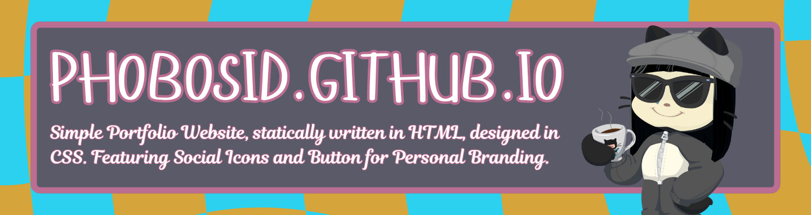

<div align="center"></div>

<p align="center">Simple Portfolio Website, statically written in HTML, designed in CSS. Featuring Social Icons and Button for Personal Branding. Hosted Through GitHub Pages. The website layout is heavily inspired by S.id and About.me Website.</p>

<div align="center">
<a href="#"></a>
<a href="#"></a>
<a href="#"></a>
</div>

<div align="center">
<a href="#"></a>
<a href="#"></a>
</div>

## View the Website

You can View my Website by [Click Here](https://phobosid.github.io) or Using:

- Linux Terminal:
```terminal
xdg-open https://phobosid.github.io
```
- Windows Command Prompt:
```cmd
explorer "https://phobosid.github.io"
```
- MacOS Terminal:
```terminal
open "https://phobosid.github.io"
```

## Website Screenshot


